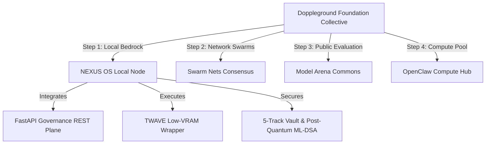

# <p align="center">🌱 T H E &nbsp; D O P P L E G R O U N D &nbsp; F O U N D A T I O N 🌱</p>
<p align="center">
  <strong>A Collective, Community-Driven Roof Organization for Open-Source Evolution</strong>
</p>

<p align="center">
  
  
  
</p>

---

> [!NOTE]
> The **Doppleground Foundation** is established as a decentralized, non-profit roof collective dedicated to empowering the global open-source community. Our mission is to build robust, community-driven computational ecosystems that transcend traditional corporate silos.
>
> We believe that the future of artificial intelligence and systems engineering belongs to the commons—engineered transparently, governed collectively, and secured against centralization.

---

## 🌍 The Vision: Open-Source Collective Intelligence

The foundation operates on the premise that no single agent, model, or organization can solve the complex alignment, security, and scalability challenges of modern AI. Instead of creating isolated, proprietary black boxes, we align community efforts to build an **evolving open-source matrix**.

```unicode
                    ┌─────────────────────────────────────────┐
                    │       DOPPLEGROUND FOUNDATION           │
                    │   Roof Collective & Non-Profit Commons  │
                    └────────────────────┬────────────────────┘
                                         │
        ┌────────────────────────────────┼────────────────────────────────┐
        ▼                                ▼                                ▼
┌───────────────┐                ┌───────────────┐                ┌───────────────┐
│  NEXUS OS     │                │   GENIUS      │                │   MODEL       │
│  Governance & │                │   TURTLE      │                │   ARENA       │
│  Orchestrator │                │  Operator UX  │                │  Evaluation  │
└───────────────┘                └───────────────┘                └───────────────┘
        │                                │                                │
        └────────────────────────────────┼────────────────────────────────┘
                                         ▼
                    ┌─────────────────────────────────────────┐
                    │      COMMUNITY-DRIVEN UPSCALING         │
                    │   Open Protocol • Shared Weights        │
                    │   Decentralized Computations            │
                    └─────────────────────────────────────────┘
```

---

## 🧬 Mindset & Evolving Structural Principles

Unlike rigid corporate or bureaucratic structures, the Doppleground Foundation operates as an **evolving, adaptive organism**. Our structure is designed to upscale dynamically based on collective developer consensus:

### 1. Evolving Structural Mindset
*   🕸️ **Decentralized Modular Cells**: Development is structured around independent, interoperable functional layers (Bridge, Governor, Vault, Engine, Swarm, TWAVE) that can be swapped or upgraded without breaking system invariants.
*   ⚖️ **Evidence-Gated Governance**: Any structural change, model inclusion, or safety default is treated as a **hypothesis**. It is only merged and promoted when backed by empirical evidence (verifiable test logs, benchmark telemetry, and audit paths).
*   🔄 **Adaptive Consensus**: Security thresholds and reasoning guidelines are dynamically adjusted by the local environment or community consensus, shifting from single-agent pipelines to quorum-based audits under high-risk environments.

### 2. Collective Community-Driven Upscaling
*   🚀 **Hardware-Independent Swarms**: Enabling developers with consumer-grade hardware to pool local CPU/GPU resources using open-source swarm components, creating decentralized high-compute clusters without corporate lock-in.
*   👥 **Multi-Party Consensus Voting**: Major decisions—ranging from package security baselines to default token budget allocation—are governed by transparent cryptographic votes across active developer nodes.
*   🔒 **Zero-Trust Collaboration**: Fostering an environment where external contributions are continuously verified by local KAIJU gates and TokenGuard safety rails, protecting the core operating layer from dependency pollution or supply-chain attacks.

---

## 🔮 NEXUS OS: The Inaugural Step

**NEXUS OS** is the official first execution layer and the foundational first step of this larger vision. By turning local models, research evidence, and collaborative agent pools into a securely governed, low-VRAM execution system, NEXUS OS proves that high-tier agentic orchestration can run entirely under local user control.



Through NEXUS, we introduce:
1.  **Auditable Provenance**: Cryptographic VAP chains that make every system change auditable.
2.  **Consensus-Gated Operations**: KAIJU gates and TrustEngine v2.2 to verify trust before action.
3.  **Local-First Resilience**: Full offline capability, protecting user data from external cloud leakage.

---

## 🚀 The Path Ahead: Future Collective Horizons

NEXUS OS is just one of many approaches the Doppleground Foundation supports to upscale open-source autonomy. Our upcoming research tracks include:

| Milestone | Target | Description | Governance State |
| :--- | :--- | :--- | :--- |
| **Phase I (NEXUS OS)** | Local Bedrock | Low-VRAM local governance, post-quantum ML-DSA-65 signatures, and secure intent routing. | **Deployed & Hardened** |
| **Phase II (Swarm Nets)** | Distributed Swarms | Multi-party consensus voting and secure task allocation across decentralized local nodes. | *In Active R&D* |
| **Phase III (OpenClaw Hub)**| Compute Commons | Community-pooled GPU orchestration and shared datasets for collaborative SFT model training. | *Conceptual Design* |
| **Phase IV (Arena Commons)**| Public Leaderboard| Unbiased, hardware-grounded local model benchmarking and adversarial stress-testing. | *Phase 0 Baseline* |

---

## 🤝 How to Contribute

We invite developers, researchers, and community advocates to join us in defining the future of open-source coordination:

1.  **Run a Local Node**: Deploy [NEXUS OS](file:///c:/Users/speci.000/Documents/NEXUS/README.md) locally to secure your own agents and models.
2.  **Submit Evidence**: Contribute model performance logs and adversarial attack patterns to help train the community's defensive models.
3.  **Propose Enhancements**: Draft structural proposals to refine KAIJU gates, GMR routing algorithms, or TWAVE resource optimizations.

---

<p align="center">
  <strong>Join us in defining the future of open-source coordination.</strong><br/>
  Doppleground Foundation © 2026. Governed by the Commons.
</p>
