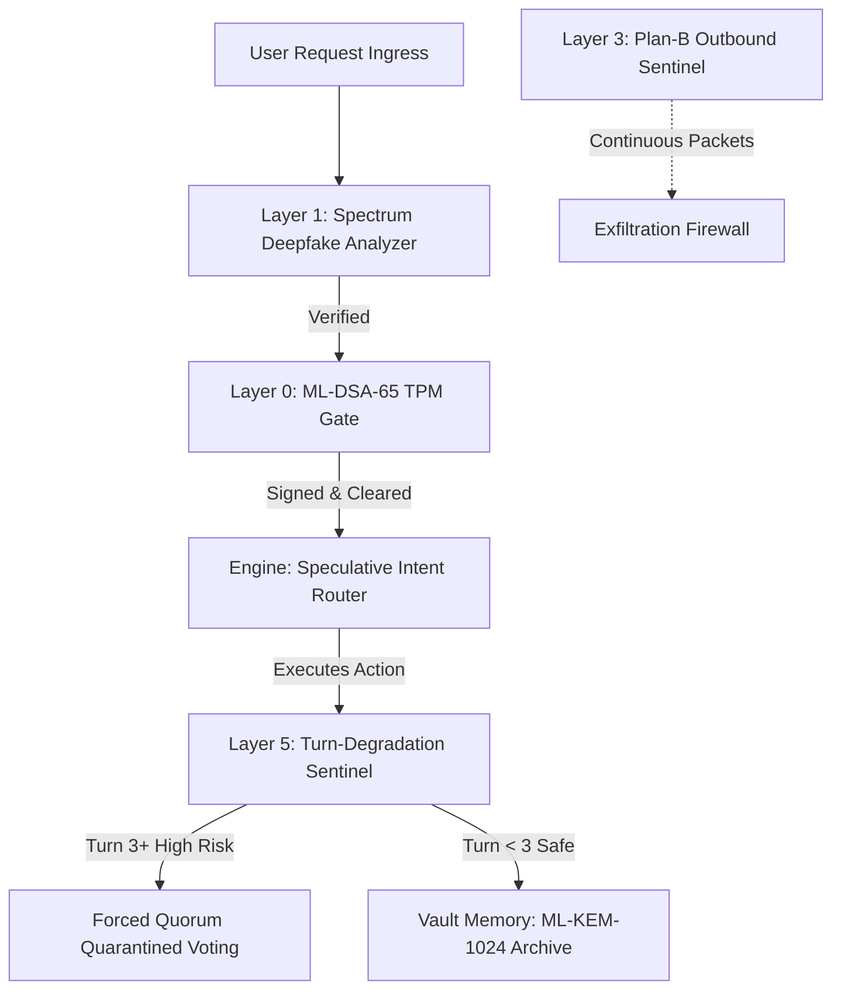

# <p align="center">🔮 N E X U S &nbsp; O S 🔮</p>
<p align="center">
  <strong>The Post-Quantum Immune, Local-First Agentic Operating System</strong>
</p>

<p align="center">
  
  
  
  
</p>

<p align="center">
  NEXUS OS turns local language models, empirical research evidence, and collaborative agent swarms into an <strong>uncompromisingly governed, fully audited, and cryptographic-hardened ecosystem</strong>. Every single agentic action is proposal-bound, execution-gated, and immutable-provenance-tracked.
</p>

---

## 🌌 System Architecture Map

```unicode
                              ┌───────────────────────────────────┐
                              │           B R I D G E             │
                              │    JSON-RPC 2.0 • MCP • SDK       │
                              └─────────────────┬─────────────────┘
                                                │
                 ┌──────────────────────────────┼──────────────────────────────┐
                 ▼                              ▼                              ▼
    ┌──────────────────────────┐   ┌──────────────────────────┐   ┌──────────────────────────┐
    │     G O V E R N O R      │   │     E N G I N E / GMR    │   │         V A U L T        │
    │  • KAIJU 4-Var Gates     │   │  • Speculative Routing   │   │  • 5-Track Memory Core   │
    │  • TrustEngine v2.2      │   │  • Hermes DAG Intent     │   │  • ML-KEM-1024 Backup    │
    │  • ML-DSA-65 TPM Signature│  │  • Speculative Rotation  │   │  • AES-GCM Encryption    │
    └────────────┬─────────────┘   └────────────┬─────────────┘   └────────────┬─────────────┘
                 │                              │                              │
                 └──────────────────────────────┼──────────────────────────────┘
                                                ▼
                              ┌───────────────────────────────────┐
                              │            S W A R M              │
                              │   Foreman Pool • worker bidding   │
                              │   OpenClaw Autospawn Engine       │
                              └─────────────────┬─────────────────┘
                                                ▼
                              ┌───────────────────────────────────┐
                              │       M O N I T O R I N G         │
                              │   TokenGuard • Budget Tracking    │
                              │   VAP Audit Ledger Chain          │
                              └─────────────────┬─────────────────┘
                                                ▼
                              ┌───────────────────────────────────┐
                              │          T W A V E  v2.0          │
                              │   ChimeraRouterV2 (tiered ERNIE)  │
                              │   Landau-Ginzburg Hallucination  │
                              └───────────────────────────────────┘
```

### 🔌 Physical Port Allocations

| Port | Service Component | Protocol | Security Scope |
| :--- | :--- | :--- | :--- |
| **`3000`** | Next.js Command Dashboard (8-Pillar Center) | HTTP / Web | SSL Restricted Ingress |
| **`7352`** | Canonical FastAPI Governance Control Plane | HTTP REST | Local-Only HMAC Authorized |
| **`7353`** | TWAVE Low-VRAM Execution Wrapper | HTTP | Local Subsystem Communication |
| **`3003`** | Swarm IPC Coordination Gate | WebSocket | Internal Loopback |
| **`11434`**| Native Ollama Engine | HTTP | Sealed Internal (Never Exposed) |

---

## 🔒 ASRCP-Q2 Post-Quantum Immunity Architecture

NEXUS OS v7 integrates the **ASRCP-Q2 Immune Framework**, shielding local agents from post-quantum state degradation, exfiltration vectors, and multi-turn alignment failures.



### The 5 Pillars of Quantum Hardening

1. **Layer 0 (Cryptographic Signature Core)**
   * **ML-DSA-65 (FIPS 204)**: Core TrustKernel TPM signatures are migrated from traditional ECC to post-quantum lattices, ensuring authentication chains cannot be factored.
   * **ML-KEM-1024 (FIPS 203)**: Vault backup archives are encrypted with ML-KEM-1024 keys to prevent "harvest now, decrypt later" quantum attacks.

2. **Layer 1 (Social & Boundary Defense)**
   * **Deepfake spectrum gateway**: Dynamic analysis of command payloads to prevent voice/video impersonation bypasses.
   * **Dual-person FIDO2 rules**: Strict physical key validation for telemetry resets and high-clearance override permissions.

3. **Layer 2 (Quantum Supply Chain)**
   * **Tomographic package scanning**: 1% randomized statistical verification of incoming PyPI modules to locate and neutralize hidden annotation payloads before local runtime import.

4. **Layer 3 (Exfiltration Firewall)**
   * **Sentinel Packet Capture**: Continuous background loopback tracing via native Sentinel commands to spot out-of-band communication anomalies.
   * **Cross-cloud cryptographic audits**: Pre-calculating SHA-256 signatures of all staged files and matching them against cloud registries.

5. **Layer 5 (Multi-Turn Quorum Guard)**
   * **Turn-degradation Hook**: Automatically degrades confidence of single-agent completions at **Turn 3+** to `0.0`, triggering a mandatory **Quorum Voting** protocol to prevent context-window drift and jailbreaks.

---

## 📁 Repository Blueprint

```bash
nexus_os/                 # Canonical Python Governance Control Plane (~50 modules)
  ├── bridge/             #   FastAPI A2A/JSON-RPC server, Deployment Gates, HMAC Keys
  ├── governor/           #   KAIJU access controls, TrustEngine v2.2, Claim Verifications
  ├── vault/              #   5-Track Memory Schema (store_track/retrieve_track), AES-GCM
  ├── engine/             #   Hermes Intent Routing, Async RPC Task Executors, Task Queues
  ├── gmr/                #   Speculative model rotation, telemetry estimators, budget limits
  ├── swarm/              #   Foreman allocations, worker pool bidding, OpenClaw spawner
  ├── monitoring/         #   TokenGuard budget track, session budget, usage limits
  ├── observability/      #   VAP Audit ledger, L1/L2 signature chains
  └── twave/              #   TWAVE v2.0 execution layer, Landau-Ginzburg tracker
src/                      # Next.js Command Center Frontend
  ├── app/                #   App layout, auth gates, api routers (19 files)
  ├── components/         #   UI panels (Overview, StressLab, GMR, Vault, Swarm)
  └── store/              #   Zustand global command state
tests/                    # Python Focused Test Suite (640+ Passing Tests)
  ├── security/           #   Encryption hard-fails, meta-attack detectors, PTY isolation
  ├── unit/               #   Claim verifications, task queue mirrors, secrets
  └── mcp/                #   Governed Model Context Protocol validation
```

---

## ⚡ Premium Code Quickstarts

### 1. Speculative Model Selection with GMR Telemetry
Choose the most resource-efficient model based on dynamic token and latency telemetry:

```python
from nexus_os.gmr import GMR, CircuitState

gmr = GMR()
# Speculatively select and route prompt
chosen_model = gmr.select("Analyze network log for exfiltration patterns")
print(f"Routed to: {chosen_model} (Telemetry Cleared)")
```

### 2. TrustEngine v2.2 Governance Check
Verify trust state with non-compensatory thresholds and active logistic math:

```python
from nexus_os.governor import Governor
from nexus_os.governor.trust_scoring import Lane

gov = Governor()
# Runs KAIJU 4-variable clearance evaluation
verdict = gov.check_access(
    agent_id="agent-01",
    action="execute",
    scope="system",
    clearance="lead"
)
if verdict.allowed:
    print("Action Cleared!")
```

### 3. Claim Verification with Audited Evidence
Verify agent accomplishments against empirical evidence before updating trust state:

```python
from nexus_os.governor.claim_verification import ClaimVerificationPipeline

pipeline = ClaimVerificationPipeline()
# Verify a claim with actual test logs and diff hashes
result = pipeline.submit_and_verify(
    agent_id="agent-01",
    claim_type="test_execution",
    evidence={
        "test_output": "640 passed in 12.3s",
        "file_exists": "tests/security/test_encryption.py"
    }
)
print(f"Claim Verified: {result['verified']} (VAP Hash: {result['vap_hash'][:16]})")
```

---

## 🧪 Rigorous Repo Hygiene & Disciplines

To preserve the cryptographic integrity and auditability of NEXUS OS:

*   🔒 **Zero Environment Leakage**: Storing raw credentials or API keys inside databases or repository fields is **strictly forbidden**. Register references via environment keys only (`apiKeyRef`) and let `.env` stay fully blacklisted.
*   🚫 **No General Adds**: Never run `git add .`. Always stage explicit, fully-reviewed file paths to prevent commit pollution.
*   🧪 **Green-Gated Merges**: Every integration branch must pass the full test baseline before main merges:
    ```powershell
    python -m pytest tests -q --ignore=tests\integration\test_heartbeat.py -p no:cacheprovider
    ```

---

## 🌱 Doppleground Foundation Collective

NEXUS OS is proudly supported by and serves as the foundational **first step** of the [Doppleground Foundation](file:///c:/Users/speci.000/Documents/NEXUS/DOPPLEGROUND_FOUNDATION.md)—a decentralised, non-profit roof collective. 

The Foundation is dedicated to an open-source community upscaling mindset, providing:
*   🤝 **Collective Community-Driven Upscaling**: Powering public models, shared computational pools, and cooperative swarms.
*   🔄 **Evolving Structural Design**: An organic, self-correcting blueprint that adapts systems and security dynamically around developer consensus.
*   🔮 **NEXUS OS First Step**: Building local-first, evidence-grounded intent orchestrators as the bedrock for global open-source coordination.

Learn more about our core philosophy and roadmap in [DOPPLEGROUND_FOUNDATION.md](file:///c:/Users/speci.000/Documents/NEXUS/DOPPLEGROUND_FOUNDATION.md).

---

## 📚 Academic Foundations

NEXUS OS stands upon the shoulders of foundational agentic research:
*   **Speculative Intent Routing**: *OR-Bench* (arXiv:2405.20947), *Speculative Routing* (arXiv:2604.09213)
*   **Adversarial Safeguards**: *RigorLLM* (arXiv:2403.13031), *ShieldGemma* (arXiv:2407.21772)
*   **Low-VRAM Tracking**: *Landau-Ginzburg Handoff* (HuggingFace 2026), *TALE* (arXiv:2603.08425)

---
<p align="center">
  <strong>Built with uncompromising precision. Governed locally. Secured for the post-quantum future.</strong><br/>
  Nexus Alpha Repository © 2026 specimba. Distributed under Apache 2.0.
</p>

