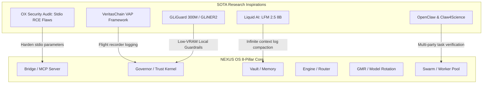

# NEXUS OS — Architectural Upgrades & Research Synthesis

This document analyzes, structures, and synthesizes key technological benchmarks, papers, and models from the bookmarked dump (`megaLinkModelPaperdump-01.txt`). It maps these breakthroughs directly onto the **8-Pillar NEXUS OS Architecture**, outlining concrete opportunities for security hardening, low-VRAM optimization, verifiable decision auditing, and high-performance local execution.

---

## 🗺️ Synthesis Overview: The 8-Pillar Nexus OS Upgrade Map

The paper dump provides outstanding inspiration across several specialized domains. By aligning these breakthroughs with our canonical 8-Pillar architecture, we can identify five critical upgrade paths:

---

## 🛡️ Pillar 1: Bridge — Stdio Command Execution Hardening (MCP Safety)

### 1. Research Grounding
*   **Target Sources**: 
    - OX Security MCP Vulnerability Audit (`https://www.ox.security/blog/the-mother-of-all-ai-supply-chains-critical-systemic-vulnerability-at-the-core-of-the-mcp/`)
    - VentureBeat: Stdio Server Takeovers (`https://venturebeat.com/security/mcp-stdio-flaw-200000-ai-agent-servers-exposed-ox-security-audit`)
    - CVE-2026-30623 (LiteLLM configuration execution), CVE-2026-30615 (Windsurf zero-click RCE)
*   **The Threat Vector**: The Model Context Protocol's official client execution model relies on `stdio` connection parameters where the client spawns servers using raw shell commands (e.g. `StdioServerParameters{command: "npx", args: ["-y", "some-mcp-server"]}`). If the agent registers or loads server configurations influenced by prompt injection, an attacker can specify arbitrary shell commands (`bash`, `curl`, `powershell`) to take complete control of the host machine.
*   **NEXUS OS Adaptation Opportunity**:
    *   **Compile-Time Allowed MCP Registry**: Block the execution of arbitrary external stdio commands. Hardcode a strictly checked allowlist of approved MCP commands, paths, and arguments.
    *   **Subprocess Shell Separation**: Force `shell=False` in all internal subprocess invocations and pass command arguments as separate array parameters.
    *   **Strict Parameter Sanitization**: Reject any stdio connection configurations where user input or agent-generated strings flows into command boundaries.

---

## 🏛️ Pillar 2: Governor — Verifiable Flight Recorders & Local Guardrails

### 1. Cryptographic Decision Flight Recorders (VAP Framework)
*   **Target Sources**:
    - VeritasChain VAP (Verifiable AI Provenance) Open Framework (`https://github.com/veritaschain/vcp-spec`, `https://dev.to/veritaschain/ai-needs-a-flight-recorder-introducing-vap-an-open-framework-for-verifiable-ai-decision-trails-2ggi`)
*   **The Breakthrough**: VAP establishes an immutable "flight recorder" for agent execution, linking each decision block to the previous block's SHA-256 hash. This guarantees the chronological integrity of the audit trail, preventing retroactive log manipulation.
*   **NEXUS OS Adaptation Opportunity**:
    *   Currently, our SQLite-backed `vap_log` in `server.py` implements basic block hashing. We can upgrade this to a standard-compliant VAP implementation:
    *   At each governance gate (claim verified, DEFCON level changed, agent quarantined), serialize a canonical payload enclosing the agent identity, exact command evidence hash, and verification status. Compute the block hash recursively:
        $$\text{Hash}_i = \text{SHA-256}(\text{Payload}_i \mathbin{\Vert} \text{Hash}_{i-1})$$
    *   This secures the vault audit trail and enables instant verification of the entire decision chain history upon startup.

### 2. High-Speed Local Guardrails (GLiGuard & GLiNER2)
*   **Target Sources**:
    - Fastino: `gliguard-LLMGuardrails-300M` (`https://huggingface.co/fastino/gliguard-LLMGuardrails-300M`, `https://github.com/fastino-ai/GLiGuard`)
    - PII Filters: `privacy-filter-nemotron` (`https://huggingface.co/OpenMed/privacy-filter-nemotron`)
*   **The Breakthrough**: GLiGuard is a highly-optimized 300M parameter token classification model designed specifically for low-VRAM hardware. It screens inputs and outputs for prompt injections, jailbreaks, and sensitive data exposure (PII) at near-zero latency, avoiding the resource overhead of massive models.
*   **NEXUS OS Adaptation Opportunity**:
    *   Integrate `GLiGuard-300M` into the `meta_attack_detector.py` filter pipeline. 
    *   Prior to running costly LLM calls, run user input through the local 300M guard model to scan for prompt injections and mask credentials.
    *   Before writing output or results back to files, screen output for PII leakage, blocking any unredacted system keys or tokens.

---

## 🗄️ Pillar 3: Vault — Infinite Context Log Compaction (Liquid AI)

### 1. Research Grounding
*   **Target Sources**:
    - Liquid Foundation Models (LFMs): `LFM2.5-8B-A1B` (`https://huggingface.co/LiquidAI/LFM2.5-8B-A1B`, `https://docs.liquid.ai/lfm/models/complete-library`)
*   **The Breakthrough**: LFMs are state-of-the-art non-transformer sequence models (based on structured state-spaces and dynamical systems). They possess constant memory scaling and are designed to process massive, long-context sequences at lightning speed, maintaining high execution accuracy over very long histories.
*   **NEXUS OS Adaptation Opportunity**:
    *   Our **Observability (Squeez)** and **Vault (5-track memory)** components generate extensive chronological event logs that quickly fill the agent's context.
    *   By deploying `LFM2.5-8B` locally (or via local API integration), we can implement an automated log-compaction pipeline.
    *   When the active context exceeds 90%, the LFM model processes the entire raw session history, extracts structural learnings, and updates the canonical memory without losing historical execution context.

---

## 🐝 Pillar 4: Swarm — Multi-Party Verification & OpenClaw Orchestration

### 1. Research Grounding
*   **Target Sources**:
    - OpenClaw & Claw4Science (`https://claw4science.org/`, `https://memory.hunyuan.tencent.com/openclaw/`)
    - AgentLaboratory (`https://github.com/SamuelSchmidgall/AgentLaboratory`)
*   **The Breakthrough**: OpenClaw and Claw4Science establish standard APIs for distributed agent swarms, defining specialized roles (foreman, researcher, executor, audit validator) and providing templates for structured research workflows.
*   **NEXUS OS Adaptation Opportunity**:
    *   Integrate OpenClaw communication protocols into our `nexus_os/swarm/` worker loop.
    *   Define a multi-agent validation pattern where a task executed by a *Worker* must receive a verification consensus from at least two separate *Validator* agents (checking exit codes and VAP hashes) before the *Foreman* marks the claim `VERIFIED` and logs it to the flight recorder.

---

## ⚖️ Policy & Compliance Grounding

### 1. Singapore Model Governance Framework for Agentic AI
*   **Target Sources**:
    - Singapore IMDA Agentic AI Governance Framework (`https://www.imda.gov.sg/resources/press-releases-factsheets-and-speeches/press-releases/2026/new-model-ai-governance-framework-for-agentic-ai`, `https://www.eversheds-sutherland.com/en/slovakia/insights/singapore-understanding-singapores-new-model-framework-for-agentic-ai-governance`)
*   **Key Guidelines**:
    - IMDA guidelines emphasize **human-in-the-loop escalation** for high-impact actions, and **rigorous auditability** of agent execution logs.
*   **NEXUS OS Compliance**:
    - Our `GovernedMCPServer` side-effect policy and `DEFCON` level lockdown mechanisms perfectly align with Singapore's guidelines by enforcing explicit manual approval on high-risk actions. Upgrading our `vap_log` to VeritasChain standards will make NEXUS OS a pioneer in auditable, compliant local-first Agent operating systems.
