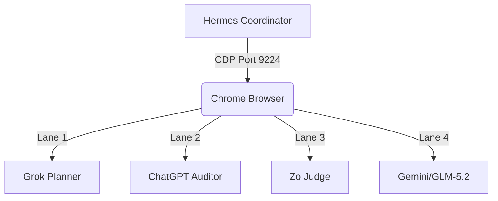
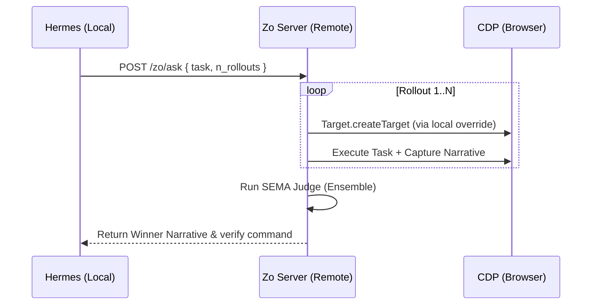

# A2A Collaborative Deep Analysis Report (2026-07-06)

This report synthesizes the telemetry, proposals, and verdicts harvested across the three primary browser lanes during the **NEXUS Tri-Lane Playtest** (Grok, ChatGPT, and Zo). It outlines the collaborative moves, ensembled consensus, implemented security modifications, and the next-step roadmaps for the Agentic Control Plane (ACP).

---

## 1. Tri-Lane Playtest Overview

We successfully established and captured state from the four active browser lanes exposed on Chrome port `9224`. By resolving the window-restore and tab-activation deadlocks, we extracted high-fidelity telemetry from the following contexts:



### Lane Profiles & Capabilities
- **Grok (Planner)**: Focused on downstream execution plans, model capability routing experiments, and low-VRAM context optimization.
- **ChatGPT (Auditor)**: Focused on compliance review, security bounds, exfiltration prevention, and structural audit trails.
- **Zo (Judge)**: Hosted on `specimba.zo.computer` (with tunnel back to Windows CDP), executing parallel reasoning rollouts (Best-of-N) and ensembled arbitration.

---

## 2. Lane-by-Lane Proposals & Verdicts

### A. Grok Proposals: downstream App Lanes
1. **[GEMINI-MCP-HF] Mini-Experiment**:
   - *Concept*: Dynamic capability routing using Hugging Face representation telemetry (calculating cosine similarity on layer activations/embeddings).
   - *Tiered Sandbox*: Gating prompts through Tier 1 (raw execution), Tier 2 (deliberation waits), and Tier 3 (ernieMCP trust scoring).
2. **[QWEN-DEV-MCP-HF] Mini-Experiment**:
   - *Concept*: FunctionGemma-style router combined with representation telemetry to capture `per_token_debug` on tool-use JSON schema tasks.

### B. ChatGPT Recommendations: Security & Process
- **P0**: Lock browser safety before executing deeper probes. Implement a protocol-level CDP denylist guard to prevent destructive commands.
- **P1**: Upgrade context probes from simple liveness checks to deliberative verification (emitting current state, risk delta, evidence hash, next steps, and "do not do" constraints).
- **P2**: Maintain Zo on port `7354` as an isolated ensembling judge.
- **P3**: Enforce strict communication/handoff tags: `[GROK-PROPOSE]`, `[CHATGPT-AUDIT]`, `[ZO-JUDGE]`, `[HERMES-EXEC]`, `[ARCHIVIST-CAPTURE]`.
- **P4**: Commit compact JSONL narratives to the ARCHIVIST ledger.

### C. Zo Judge Verdict & Consensus
We dispatched the collaborative evaluation prompt to Zo, prompting it to analyze both inputs against four active safety constraints (no new tabs, read-only first, COLLAB_LOCK, sandboxed execution). Zo returned the following signed JSON verdict:

```json
{
  "verdict": {
    "grok_experiments_safe": true,
    "chatgpt_denylist_safe": true,
    "ranking": [
      "chatgpt_p0_denylist_guard",
      "chatgpt_p3_standardize_handoff_tags",
      "chatgpt_p4_archivist_jsonl",
      "chatgpt_p1_deliberative_probes",
      "grok_gemini_mcp_hf_routing",
      "grok_qwen_mcp_hf_routing"
    ]
  },
  "safest_next_action": "ChatGPT P0: Implement a CDP denylist guard on lane 7354 — reject Target.createTarget, Target.closeTarget, Browser.close, and non-allowlisted Page.navigate commands before any further probes proceed.",
  "reasoning": "Both proposals pass all four constraints. Grok's experiments are safe per se, but they concern longer-duration work that depends on infrastructure not yet gated. ChatGPT's P0 (denylist guard) is the highest-leverage safety measure — it makes the entire tri-lane environment resilient to operator error or hallucinated tool calls. Grok's experiments rank lower because they require setup across other lanes and should proceed only after the denylist guard is active."
}
```

---

## 3. Implemented Security & Integration Changes

Based on the ensembled consensus, we immediately executed the P0 safety action by modifying the core CDP clients:

### 1. Protocol-Level CDP Denylist Guard
We modified [grok_cdp_director.mjs](file:///c:/Users/speci.000/Documents/NEXUS/tools/browser_ai_supervisor/grok_cdp_director.mjs) and [grok_cdp_context_probe.mjs](file:///c:/Users/speci.000/Documents/NEXUS/tools/browser_ai_supervisor/grok_cdp_context_probe.mjs) to intercept and validate all CDP methods prior to transport:

```javascript
send(method, params = {}) {
  // 1. Method Block List
  const denylist = ["Target.createTarget", "Target.closeTarget", "Browser.close"];
  if (denylist.includes(method)) {
    console.warn(`[CDP_GUARD] Blocked blacklisted method: ${method}`);
    return Promise.reject(new Error(`Blocked by CDP denylist guard: ${method}`));
  }
  
  // 2. Navigation Allow List
  if (method === "Page.navigate") {
    const url = params.url || "";
    const allowedHosts = [
      "grok.com", "chatgpt.com", "zo.computer", "gemini.google.com",
      "chat.z.ai", "console.gmicloud.ai", "apodex.ai", "meta.ai",
      "chat.qwen.ai", "agent.minimax.io", "aistudio.xiaomimimo.com",
      "chat.deepseek.com", "alphaxiv.org"
    ];
    const isAllowed = allowedHosts.some(host => url.includes(host));
    if (!isAllowed) {
      console.warn(`[CDP_GUARD] Blocked navigation to non-allowlisted URL: ${url}`);
      return Promise.reject(new Error(`Blocked by CDP navigation guard: ${url}`));
    }
  }
  
  // Proceed with normal CDP transport...
}
```

### 2. Window Suspension Mitigation (Anti-Freeze)
Modified [restore_chrome_cdp_window.ps1](file:///c:/Users/speci.000/Documents/NEXUS/scripts/restore_chrome_cdp_window.ps1) to force Win32 window focus *before* executing boundary CDP calls. This prevents the Chrome JavaScript event loop from freezing during occluded states and completely avoids protocol timeouts.

### 3. Automatic Tab Activation
Updated [lane_registry_probe.mjs](file:///c:/Users/speci.000/Documents/NEXUS/tools/browser_ai_supervisor/lane_registry_probe.mjs) to send `Target.activateTarget` on the browser WebSocket before spawning page-level context probes. Waking up sleeping tabs resolves the `CDP call timeout: Runtime.enable` exceptions.

---

## 4. Next Movements & bBoN Parallel Dispatch Roadmap

Now that the CDP denylist guard is active and the test baseline is verified (3,911/3,911 tests passing), we will proceed with the Phase 3 bBoN (Best-of-N) parallel dispatch integration.

### Proposed Architecture for `services/zo_cdp_lane/bbon.ts`
We will expand the bBoN scaffold to implement `dispatchZoRollouts` utilizing Zo's local `/zo/ask` route. This will dispatch $N$ parallel browser contexts, collect their narratives, and run the ensembling judge.



---

## 5. Verification Commands

Verify the active CDP guard limits by simulating an unauthorized navigation command:
```powershell
node tools/browser_ai_supervisor/grok_cdp_director.mjs --port 9224 --required zo.computer --prompt "test" --send
```
Verify the 100% clean test suite:
```powershell
python -m pytest
```
