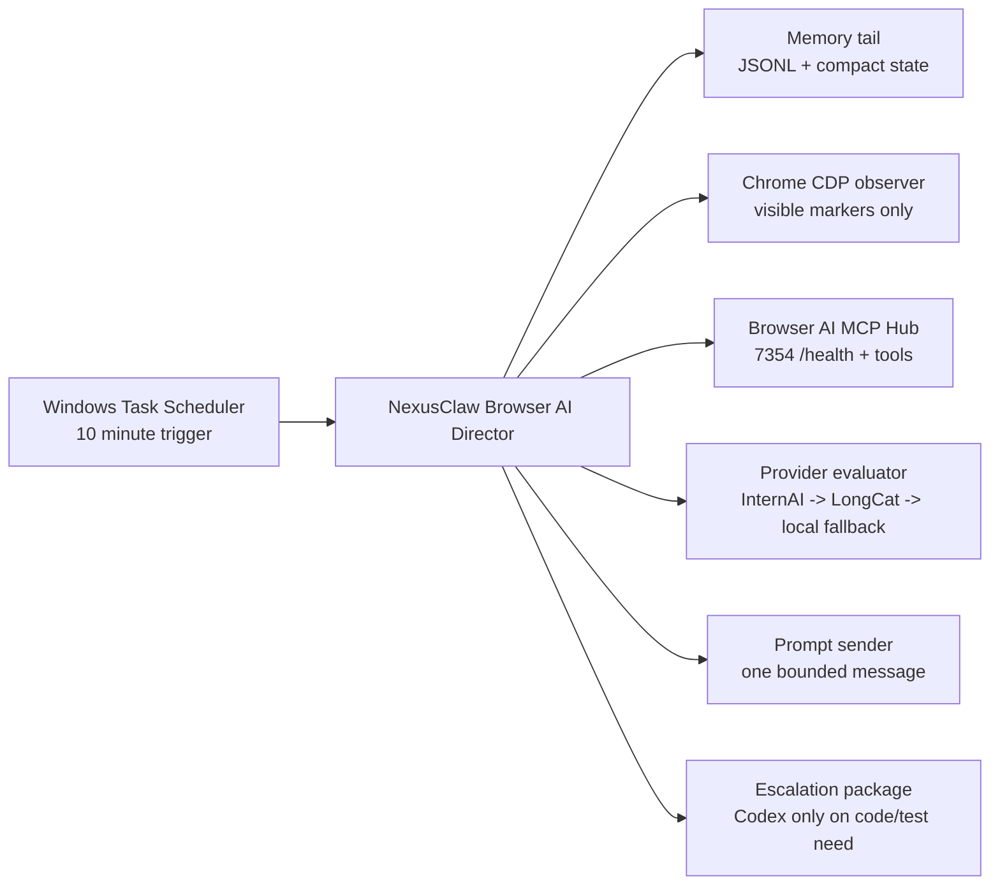

# NEXUS External Browser AI Director

Date: 2026-06-21
Status: V0 design, implementation-ready

## Purpose

Replace token-expensive Codex heartbeat automations with one local NexusClaw director that supervises browser-sourced AI surfaces every 10 minutes without using Codex tokens.

The director handles Grok first, then adapts to Z.ai/GLM, Zo, ChatGPT, Qwen, and other browser-hosted agent surfaces.

Codex is only escalated when there is a concrete local engineering package: patch, changed-file list, verification command, failure log, or security review request.

## Grounded Inputs

- Grok control memory requires visible authenticated UI state, cheap checks first, and at most one bounded control message per run.
- Hermes log `NEXUSubuntuHERMESlog-03.txt` confirms InternAI is wired for ModelRelay/Hermes/Claw lanes and LongCat is the next direct API provider candidate.
- Focused provider verification passed locally: `python -m pytest tests\test_internai_provider_config.py tests\test_longcat_provider_config.py -q --tb=short` -> `13 passed`.
- Current Grok CDP route is authenticated Chrome on port `9224`; CDP `9222` is an OBS/browser-source surface and must not be used for Grok.
- `7352` remains Brain API only. `7354` is the GROSS/Grok MCP bridge. `7355` is internal ModelRelay fallback.

## Architecture



## 10 Minute Cycle

1. Read last 20 memory entries for the target source.
2. Run control-surface doctor for the configured CDP port and URL regex.
3. Check MCP bridge health only if the target task needs bridge access.
4. Capture bounded visible state: URL, title, newest assistant marker, generation status, artifact names, and error banner.
5. If the fingerprint is unchanged, write `NOOP_UNCHANGED` and exit without provider or Codex.
6. If the model is still generating, write `WAITING_MODEL` and exit.
7. If there is a new artifact or failure, call the free-provider evaluator once, subject to cooldown and budget.
8. If the evaluator approves a next prompt and rate limits allow, submit one bounded prompt through CDP.
9. Write memory outro with run id, fingerprint, action, prompt hash, provider used, and next action.
10. Emit `ESCALATE_CODEX` only when local repo implementation or verification is required.

## Provider Routing

| Tier | Provider | Use | Rule |
|---|---|---|---|
| 0 | Deterministic heuristics | No-change checks, page readiness, bridge health, fingerprint compare | Always first, zero model call |
| 1 | Local small model or rules | Classify simple status and prompt readiness | Optional; must not load broad Ollama runners |
| 2 | InternAI | Cheap director reasoning, code/research/security routing | Primary free/provider lane when key exists |
| 3 | LongCat | Long-context synthesis, multi-turn artifact review, weekly summaries | Not every 10 minutes; use on material deltas only |
| 4 | OpenRouter/free fallbacks | Emergency only | Cooldown after 402/429; never default |
| 5 | Codex | Local implementation, tests, security review, repo edits | Manual or high-confidence escalation only |

## Memory Schema

Each run appends one JSONL record:

```json
{
  "run_id": "20260621T190000Z-grok",
  "source_id": "grok-project-nexus",
  "started_at": "2026-06-21T19:00:00Z",
  "cdp_port": 9224,
  "target_url_regex": "grok\\.com",
  "visible_fingerprint": "sha256:...",
  "bridge_health": "ok|down|skipped",
  "provider": "none|internai|longcat|local|codex_escalation",
  "action": "NOOP_UNCHANGED|WAITING_MODEL|CONTINUE_SENT|ARTIFACT_CAPTURED|BLOCKED_SETUP|ESCALATE_CODEX",
  "prompt_hash": "sha256:...",
  "artifact_refs": [],
  "blocker": null,
  "next_action": "..."
}
```

## Director Rules

- Never use Codex for routine browser checking.
- Never inspect cookies, localStorage, passwords, tokens, session stores, browser history, unrelated tabs, or private files.
- Never send raw NEXUS logs, secrets, local paths with sensitive names, or GROSS evidence into browser AI.
- Never expose `7352` to browser AI or tunnels.
- Do not run broad provider health polling; provider health is lazy and demand-driven.
- Do not load all Ollama models as a health check.
- Do not send more than one browser prompt per source per cycle.
- Do not retry a blocked UI forever. Persist `BLOCKED_SETUP` with exact repair instruction.
- For Grok, use authenticated Chrome CDP `9224` unless a newer verified port is recorded in memory.

## Grok First Implementation

Target:

```text
https://grok.com/project/99253cca-2469-4454-8593-0f173b7f640f?chat=4d8d8598-9da7-4639-918e-4ceb6a8812ba
```

Required local checks:

```powershell
powershell -NoProfile -ExecutionPolicy Bypass -File tools\browser_ai_supervisor\control_surface_doctor.ps1 -CdpPorts 9224 -RequiredUrlPattern 'grok\.com' -Json
Invoke-WebRequest -UseBasicParsing http://127.0.0.1:7354/health
```

Decision policy:

- No authenticated Grok tab -> `BLOCKED_SETUP`.
- Same visible marker as previous run -> `NOOP_UNCHANGED`.
- New answer without artifact -> provider summarizes tail and proposes one next prompt.
- New artifact -> provider produces local verification checklist; Codex escalates only if local files/tests are needed.
- Bridge down while task needs MCP -> `BLOCKED_SETUP` with start command for `tools\browser_ai_mcp\start_grok_mcp_v2.ps1`.

## Scheduler

Use Windows Task Scheduler, not Codex automations, for the 10-minute loop.

The scheduled command should run a local script such as:

```powershell
powershell -NoProfile -ExecutionPolicy Bypass -File tools\browser_ai_supervisor\run_external_director.ps1 -Source grok -Mode cheap
```

Cadence policy:

- Cheap deterministic checks: every 10 minutes.
- Provider evaluations: max 3 per hour per source.
- Browser prompt submissions: max 1 per hour per source unless operator overrides.
- Codex escalations: manual or daily digest only.

## Extension To Other Sources

| Source | Driver | Cadence | Provider role |
|---|---|---:|---|
| Grok | Chrome CDP 9224 | 10 min cheap, 60 min prompt cap | InternAI evaluator |
| Z.ai / GLM-5.2 | Dedicated browser profile/window | 30-60 min cheap, prompt only on readiness | LongCat for long diff summaries |
| Zo Computer | Public/advisory page or authenticated visible tab | 60 min | InternAI/LongCat digest only |
| ChatGPT browser MCP | Browser UI + custom MCP connector | 60 min | InternAI evaluator, Codex only for repo work |
| Qwen | Authenticated tab | 60 min | InternAI evaluator |

## Security Controls

MCP research and the 2025-06-18 MCP transport spec require:

- Origin validation for HTTP/SSE MCP endpoints.
- Local binding to `127.0.0.1` by default.
- Proper authentication for exposed endpoints.
- Provenance tracking and audit logging for every tool call.
- No remote `stdio`.
- No browser AI tool call may directly write NEXUS source files.

CDP is powerful enough to control browser state. Treat each CDP port as a privileged local tool:

- One browser profile per source.
- One CDP port per source.
- URL allowlist before any DOM read or prompt send.
- Bounded visible-state extraction only.
- Close or idle unused windows to control RAM.

## Implementation Milestones

1. Add `run_external_director.ps1` wrapper and `external_browser_ai_director.py`.
2. Add fake-provider tests proving unchanged fingerprints do not call providers.
3. Add InternAI dry-run provider evaluator.
4. Add LongCat material-delta summarizer with cooldown.
5. Add Task Scheduler install/uninstall scripts.
6. Move Codex automations to six-hour advisory/digest cadence or pause them after the local director is active.

## Done Criteria

- A 10-minute Grok cycle can run five times with zero Codex tokens.
- Unchanged state exits as `NOOP_UNCHANGED`.
- Missing auth or bridge exits as `BLOCKED_SETUP` with exact fix.
- One material Grok answer produces a provider-reviewed next prompt or Codex escalation package.
- Memory contains every run start/outro, including failures.
- Provider tests stay green.

