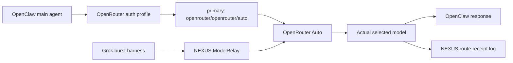

# OpenRouter Auto For Zo/OpenClaw/Grok Integration

<!-- CANARY: f03f267f125d5e7ab67e22408141c2c5 -->
Date: 2026-05-25
Purpose: Turn the new OpenRouter Auto routing update into a safe trial plan for Zo OpenClaw, NEXUS ModelRelay, and the Grok burst harness.

## Actionable Insight

Use OpenRouter Auto as the cheap/default provider lane for routine OpenClaw and Grok-harness support tasks, but keep NEXUS ModelRelay as the policy layer and keep pinned models for coding, security, final verification, and any high-risk tool path.

## Source-Ranked Matrix

| Source | Strength | Finding | NEXUS Use |
|---|---:|---|---|
| OpenRouter Auto Router docs | High | Raw OpenRouter API uses `model: "openrouter/auto"` and returns the actually selected model in `response.model`. The pool can change over time. | Add Auto as a logged routing candidate, not a silent black box. |
| OpenRouter OpenClaw integration docs | High | OpenClaw uses the prefixed model string `openrouter/openrouter/auto`; docs explicitly recommend it for heartbeats/status checks and show OpenClaw fallback config. | Fix the active OpenClaw `main` model away from provider `openai` toward OpenRouter. |
| OpenRouter model fallback docs | High | Fallbacks are represented with a `models` array in raw API calls; pricing is based on the model that ultimately succeeds. | ModelRelay should use explicit fallback chains and log the final model. |
| OpenRouter API reference | High | Request schema includes OpenRouter-only `models?: string[]` and `route?: "fallback"`. | The email's `route="fallback"` is real API surface, but implementation should still be tested against current SDK behavior. |
| OpenRouter provider routing docs | High | Provider routing can constrain providers, require parameters, control data collection, and route only to providers supporting requested tools. | For tool-calling agents, require parameter support or pin known-good models. |
| OpenRouter router metadata docs | Medium | `openrouter_metadata` can expose strategy/attempt/provider/pipeline, but it is experimental and unstable. | Use it for debug logs only, not stable production logic. |
| Local Zo/OpenClaw digest | High local evidence | Dashboard worked, but active `main` agent failed with "No API key found for provider openai." | This is a model/auth mapping problem, not a Tailscale problem. |
| Local Grok long-run report | High local evidence | Grok should be a proposal/burst worker; NEXUS owns durable queue and verification. | Auto can power cheap classification/rewrite lanes, not trusted completion. |

Source links:

- OpenRouter Auto Router: `https://openrouter.ai/docs/guides/routing/routers/auto-router`
- OpenRouter Auto model page: `https://openrouter.ai/openrouter/auto`
- OpenRouter OpenClaw integration: `https://openrouter.ai/docs/cookbook/coding-agents/openclaw-integration`
- OpenRouter model fallbacks: `https://openrouter.ai/docs/guides/routing/model-fallbacks`
- OpenRouter API reference: `https://openrouter.ai/docs/api/reference/overview`
- OpenRouter provider routing: `https://openrouter.ai/docs/guides/routing/provider-selection`
- OpenRouter router metadata: `https://openrouter.ai/docs/guides/features/router-metadata`

## Current Local Problem

From `docs/handoff/zo-coordination/ZO_OPENCLAW_MODELRELAY_DIGEST_2026-05-24.md`:

```text
Agent failed before reply: No API key found for provider "openai".
```

Interpretation:

- Tailscale/dashboard reachability is solved.
- The active OpenClaw `main` agent is still mapped to provider `openai`.
- Adding or funding OpenRouter does not help until the active model string and auth profile are changed.
- The correct OpenClaw model string is not raw `openrouter/auto`; it is `openrouter/openrouter/auto`.

## Recommended Trial Design



Design rule:

```text
OpenClaw chooses OpenRouter.
OpenRouter chooses cheap/fit model.
NEXUS logs what actually happened.
NEXUS verifier decides whether output is accepted.
```

## OpenClaw Configuration Target

Use this only after redacted `openclaw security audit --deep` and gateway checks are clean.

Recommended OpenClaw model target:

```json
{
  "agents": {
    "defaults": {
      "model": {
        "primary": "openrouter/openrouter/auto",
        "fallbacks": [
          "openrouter/~anthropic/claude-haiku-latest",
          "openrouter/deepseek/deepseek-chat"
        ]
      },
      "models": {
        "openrouter/openrouter/auto": {},
        "openrouter/~anthropic/claude-haiku-latest": {},
        "openrouter/deepseek/deepseek-chat": {}
      }
    }
  }
}
```

If the environment only supports one model first, start with:

```json
{
  "agents": {
    "defaults": {
      "model": {
        "primary": "openrouter/openrouter/auto"
      },
      "models": {
        "openrouter/openrouter/auto": {}
      }
    }
  }
}
```

Auth profile target:

```json
{
  "auth": {
    "profiles": {
      "openrouter:default": {
        "provider": "openrouter",
        "mode": "api_key"
      }
    }
  }
}
```

Do not put raw keys in tracked config or chat. Use OpenClaw keychain/auth tooling.

## Raw OpenRouter API Pattern

For ModelRelay or a small probe, raw API uses:

```python
from openai import OpenAI

client = OpenAI(
    base_url="https://openrouter.ai/api/v1",
    api_key=OPENROUTER_API_KEY,
)

response = client.chat.completions.create(
    model="openrouter/auto",
    messages=[{"role": "user", "content": "Reply with OK and one sentence."}],
    extra_body={
        "models": [
            "anthropic/claude-haiku-latest",
            "deepseek/deepseek-chat",
        ],
        "route": "fallback",
    },
)

print(response.model)
```

Notes:

- `response.model` must be logged.
- `route: "fallback"` exists in the official request schema, but the fallback guide's stable pattern is the `models` array. Test both in the actual client before relying on SDK-specific syntax.
- Billing follows the model that served the successful response.

## ModelRelay Integration

Add `openrouter/auto` as a route in ModelRelay only as a provider strategy, not as a replacement for local routing rules.

Suggested lanes:

| Lane | ModelRelay Default | Reason |
|---|---|---|
| heartbeat/status | `openrouter/auto` | Cheap simple traffic. |
| summarization/triage | `openrouter/auto` with logging | Let router downgrade simple work. |
| Grok artifact pre-check | `openrouter/auto` | Low-risk structural critique. |
| coding patch generation | pinned code model | Auto may pick weaker/expensive model unpredictably. |
| security review | pinned known-good model | Needs consistency and auditability. |
| final NEXUS verifier | local deterministic tests + pinned model if needed | Do not rely on Auto for acceptance. |

Required ModelRelay telemetry:

```json
{
  "requested_model": "openrouter/auto",
  "served_model": "<response.model>",
  "provider": "openrouter",
  "lane": "heartbeat|triage|grok_precheck|coding|security",
  "input_tokens": 0,
  "output_tokens": 0,
  "estimated_cost": 0,
  "fallback_attempt": false
}
```

Optional debug telemetry:

- Enable OpenRouter router metadata during pilot only.
- Parse permissively.
- Do not depend on field names because the metadata is experimental.

## Grok Harness Use

For `docs/handoff/grok-longrun/`, OpenRouter Auto is useful for:

- Creating a cheap second opinion on a Grok proposal.
- Classifying whether a Grok outbox artifact is missing evidence.
- Summarizing rejected artifacts into the next bounded task.
- Running low-cost "does this output follow schema?" checks.

OpenRouter Auto is not enough for:

- Trusting Grok's "done" claims.
- Applying patches.
- Running shell commands.
- Accessing secrets.
- Final security approvals.

The Grok harness remains:

```text
Grok proposes -> verifier checks -> NEXUS accepts/rejects
```

## Safety Policy

### Do

- Log `response.model` for every Auto request.
- Keep a weekly histogram of selected models and cost.
- Use OpenClaw fallbacks on top of OpenRouter provider failover.
- Use provider constraints for tool-calling requests.
- Keep OpenRouter keys in auth profiles/keychain.
- Keep OpenAI provider disabled unless a real OpenAI key is intentionally configured.

### Do Not

- Do not use Auto for high-risk governance decisions.
- Do not assume the Auto pool is stable.
- Do not allow Grok to trigger side-effect tools based on Auto output.
- Do not expose raw OpenClaw dashboard/API publicly.
- Do not commit `auth-profiles.json` or raw provider keys.

## Trial Plan

### Phase 1 - OpenClaw Provider Repair

Run on Zo/OpenClaw:

```bash
openclaw status --deep
openclaw agent list
openclaw auth list
```

Check active `main` model config:

```bash
cat /root/.openclaw/agents/main/agent/models.json
cat /root/.openclaw/openclaw.json
```

Fix target:

- `main` must no longer request provider `openai`.
- `main` should request `openrouter/openrouter/auto`.
- `openrouter:default` auth profile must exist and resolve through OpenClaw auth tooling.

### Phase 2 - Single Prompt Smoke Test

After restart:

```bash
openclaw gateway probe
openclaw security audit --deep
openclaw logs --follow
```

Dashboard test prompt:

```text
Provider smoke test. Reply with exactly: OPENROUTER_AUTO_OK
```

Acceptance:

- No "provider openai" error.
- No raw key in logs.
- Response returns.
- Logs identify OpenRouter path or selected model.
- Security audit stays clean except expected private Tailscale notes.

### Phase 3 - Cost Drift Probe

Run 20 low-risk prompts:

- 5 heartbeat/status prompts
- 5 summary prompts
- 5 short coding explanation prompts
- 5 Grok artifact schema-check prompts

Record:

- selected model
- latency
- tokens
- cost if available
- success/failure
- whether output was acceptable

Acceptance:

- Routine prompts mostly route cheaper than pinned frontier models.
- No unexpected expensive-model spike without clear reason.
- No rate-limit loop.

### Phase 4 - ModelRelay Experiment

Add a ModelRelay route named:

```text
openrouter-auto
```

Behavior:

- Raw OpenRouter model: `openrouter/auto`
- Lane defaults: heartbeat, triage, Grok pre-check
- Fallback chain: explicit `models` list
- Required log field: `served_model`

Do not make `openrouter-auto` the only path. It is a route option inside ModelRelay.

## Rollback

If OpenClaw fails after the change:

1. Revert `main` to the last known working OpenRouter pinned model.
2. Keep OpenAI disabled unless a real OpenAI key is configured.
3. Keep Tailscale dashboard private.
4. Save redacted logs to `docs/handoff/zo-coordination/`.

Rollback target:

```json
{
  "model": {
    "primary": "openrouter/deepseek/deepseek-chat"
  }
}
```

## Open Questions To Verify In Zo

- Does Zo OpenClaw expose a command to set `agents.defaults.model.primary`, or must config be edited directly?
- Does OpenClaw log the actual served OpenRouter model, or only the requested OpenClaw model string?
- Does OpenClaw support passing `provider` constraints or OpenRouter `models` arrays, or only its own `fallbacks` list?
- Does the active dashboard agent read `/root/.openclaw/openclaw.json` or per-agent files under `/root/.openclaw/agents/main/agent/` first?

## Final Recommendation

Trial `openrouter/openrouter/auto` on Zo OpenClaw for low-risk agent traffic immediately after confirming auth/profile mapping, but keep the durable NEXUS pattern:

```text
OpenClaw/Zo uses OpenRouter Auto for cheap execution.
NEXUS ModelRelay logs and constrains routing.
Grok remains proposal-only.
Pinned models and tests remain the acceptance authority.
```
