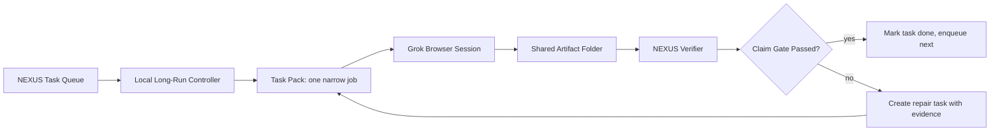

# Grok Long-Run MCP Automation Review

<!-- CANARY: f353bd0c16e4deeac1d55339df4c07e7 -->
Date: 2026-05-25
Scope: Review `C:/Users/speci.000/Downloads/files-53db86af.zip`, compare it to the live NEXUS governed MCP bridge, and define a practical workaround for Grok's short burst behavior.

## Evidence Read

- Extracted package: `scratch/grok-files-53db86af/`
- Main Grok scaffold: `scratch/grok-files-53db86af/mcp_server/`
- Duplicate package tree: `scratch/grok-files-53db86af/NEXUS_MCP_Server_Phase6/`
- Red-team scenarios: `scratch/grok-files-53db86af/NEXUS_Red_Team_Lab/docs/MCP_Red_Team_Lab_Specification.md`
- Existing NEXUS MCP bridge: `nexus_os/mcp/server.py`
- Existing NEXUS MCP tests: `tests/mcp/test_governed_mcp_server.py`

Verification run:

```text
py -3.13 -m pytest tests\mcp\test_governed_mcp_server.py -q
6 passed, 1 warning in 0.26s
warning: pytest could not create .pytest_cache due Access denied
```

## Verdict

Grok produced a useful concept package, not a production-ready long-run automation system.

The useful parts are:

- The governed MCP server concept.
- The tool-risk taxonomy: read-only, medium-risk audit, high-risk side effect.
- The red-team MCP scenarios.
- The explicit statement that skills are policy and MCP is the execution bridge.

The unsafe or incomplete parts are:

- TrustKernel is stubbed by default.
- Real TrustKernel mode falls back to stub after failure.
- Connectors are stubs.
- No authentication layer is implemented.
- The package duplicates itself and includes generated cache files.
- It uses a custom JSON-RPC MCP-shaped server, not the official MCP SDK.
- The "long-run" fix is mostly self-instruction and long responses, which does not solve runtime/session limits.

The correct path is not to force Grok to work longer than its host allows. The correct path is to make Grok useful in bounded bursts and put continuous execution in a local NEXUS/OpenClaw/Zo controller.

## Root Cause Of The 20 Second Burst Problem

The short completion behavior is likely a host/runtime property, not a prompt problem.

Observed behavior:

- Grok responds with mission-completion language after one short chunk.
- It asks for confirmation instead of continuing.
- It optimizes for a polished status message rather than artifact production.
- It proposed word-count minimums, which increases text volume but not verified work.

Likely causes:

- Browser chat runtimes are request/response loops, not durable workers.
- The UI has implicit turn budget, latency, and safety stop behavior.
- Custom MCP tools expose actions but do not create an external scheduler.
- Skills can steer behavior but cannot override the host's stop conditions.
- Without an external watchdog, the model decides when it is "done."

Conclusion: prompts can improve style, but they cannot reliably convert a browser-chat agent into a long-running worker.

## Source-Grounded Best Practice

External research points to the same design:

- Anthropic's long-running harness pattern says agents must bridge discrete sessions with initializer artifacts, progress logs, feature lists, git history, and one-feature incremental work.
- Anthropic's effective-agent guidance says simple composable workflows should be preferred before complex autonomous systems.
- MCP's server model exposes prompts, resources, and tools; tools are model-controlled functions, so tool exposure must be governed.
- xAI's Grok connector docs confirm custom MCP connectors are reachable tools for Grok, not a scheduler; local MCP servers need a public tunnel.
- Cloudflare's long-running agent docs describe durable agents as persistent identities that wake on events, not always-on loops.

NEXUS design implication: treat Grok as a high-speed burst model behind a governed tool interface. Let NEXUS provide the durable identity, queue, state, watchdog, and verification.

## What Grok Built

### 1. Governed MCP Scaffold

Grok created `governed_mcp_server.py` with:

- `initialize`
- `tools/list`
- `tools/call`
- `governance.get_status`
- `system.health`
- `drift_monitor.run_sweep`
- `telegram.send_message`
- `notion.create_page`

This is directionally correct, but it is still a skeleton.

### 2. TrustKernel Adapter

`trustkernel/trustkernel_adapter.py` exposes `consult_trustkernel()` and switches between `stub` and `real`.

Problem: real mode raises `NotImplementedError`, catches the error, and falls back to stub. For NEXUS security-sensitive execution, this is the wrong default. Real mode failure must hard-fail closed.

Required change before any integration:

```text
if mode == real and real TrustKernel is unavailable:
  deny action
  emit audit event
  do not fall back to stub approval semantics
```

### 3. Connector Stubs

Telegram and Notion connectors are stubs. That is acceptable for a lab, but it must be labeled as dry-run only. Do not expose these as real capabilities to Grok until:

- Secrets are stored outside the repo.
- Connector scopes are allowlisted.
- Audit events are durable.
- Side effects require explicit operator enablement.

### 4. Red-Team Lab Spec

The red-team scenarios are useful and should be retained as test-design input:

- MCP-01 path traversal and symlink escape
- MCP-02 command injection through tool arguments
- MCP-03 gradual memory poisoning
- MCP-04 credential harvesting and exfiltration
- MCP-05 UI layer bypass
- MCP-06 multi-step attack chain

These should become NEXUS MCP test cases, not Grok-facing live tools.

## Existing NEXUS Advantage

NEXUS already has a better MCP bridge at `nexus_os/mcp/server.py`.

It improves on Grok's scaffold by:

- Defaulting `trustkernel_mode` to `real`.
- Defaulting `allow_side_effects` to `false`.
- Distinguishing read-only actions from side-effect actions.
- Returning dry-run connector payloads rather than pretending real connector execution exists.
- Recording audit events.
- Having focused tests that pass.

Current test evidence:

```text
tests/mcp/test_governed_mcp_server.py
6 passed
```

Therefore, the Grok package should be mined for ideas and tests. It should not replace the NEXUS MCP server.

## Recommended Architecture: Grok Burst Harness

Goal: use Grok's speed without trusting its completion judgment.



Core rule: Grok is never the source of truth for task completion. It is a worker that proposes artifacts.

## Minimal Tool Surface For Grok

Expose only these MCP tools at first:

### Read-only tools

- `nexus.get_state_digest`
- `nexus.get_task_context`
- `nexus.search_evidence`
- `nexus.list_allowed_files`

### Proposal tools

- `task.submit_patch_proposal`
- `task.submit_research_note`
- `task.submit_test_plan`
- `task.request_review`

### No direct tools yet

- No shell execution.
- No arbitrary file write.
- No deletion.
- No secrets access.
- No connector sends.
- No memory mutation.
- No Git commands.

Side-effect tools can be added later only after the controller and verifier are stable.

## Shared Folder Contract

Use a deterministic folder instead of relying on chat memory:

```text
docs/handoff/grok-longrun/
  README.md
  state/
    feature_list.json
    progress.jsonl
    current_task.json
  inbox/
    task-0001.md
  outbox/
    task-0001.result.md
    task-0001.patch
    task-0001.evidence.json
  rejected/
  accepted/
```

Preferred state format:

- `feature_list.json` for task truth because JSON is harder for agents to casually rewrite incorrectly than Markdown.
- `progress.jsonl` for append-only event history.
- `current_task.json` for the active burst assignment.
- Markdown only for human-readable summaries.

## Burst Task Contract

Each Grok task should fit one short burst.

Required input fields:

```json
{
  "task_id": "grok-0001",
  "objective": "Classify MCP red-team scenarios into NEXUS test backlog items.",
  "allowed_paths": ["scratch/grok-files-53db86af/NEXUS_Red_Team_Lab/docs/MCP_Red_Team_Lab_Specification.md"],
  "forbidden_actions": ["delete", "execute_shell", "expose_secrets", "git_push"],
  "required_output": ["result.md", "evidence.json"],
  "done_gate": "Every claim must cite a source path and line or explicit artifact."
}
```

Required output fields:

```json
{
  "task_id": "grok-0001",
  "status": "proposed",
  "artifacts": ["outbox/grok-0001.result.md"],
  "evidence": ["source path or URL"],
  "self_check": ["what was verified", "what was not verified"],
  "next_recommended_task": "grok-0002"
}
```

## Better Long-Run Rule

Reject Grok's proposed rule:

```text
minimum 1200-2000 words
```

Replace it with:

```text
minimum one verified artifact per burst
```

Good burst:

- Reads the assigned context.
- Produces one patch, one report, or one test plan.
- Cites evidence.
- States what remains unverified.
- Stops cleanly.

Bad burst:

- Writes a long motivational explanation.
- Claims broad mission completion.
- Creates new architecture without grounding.
- Asks for confirmation before producing an artifact.

## Controller Loop

The durable controller should be local, not inside Grok.

Loop:

1. Read `feature_list.json`.
2. Pick one failing task.
3. Write `current_task.json`.
4. Send a compact prompt to Grok.
5. Wait for outbox artifact.
6. Validate schema.
7. Run claim gate.
8. If passed, move artifact to `accepted/`.
9. If failed, move artifact to `rejected/` and create a repair task.
10. Append event to `progress.jsonl`.

Stop conditions:

- No task available.
- Verification fails 3 times on the same task.
- Output contains raw secrets.
- Grok attempts forbidden action.
- Artifact schema invalid twice.

## Claim Gates

No task is complete unless at least one is true:

- A test passed and output is captured.
- A file diff exists and was reviewed.
- A report cites exact local paths and external sources.
- A verifier script accepted the artifact schema.

Completion language should be normalized:

- Grok says "done" means "proposal submitted."
- NEXUS verifier says "done" means "accepted."
- Operator says "approved" means "can merge or integrate."

## How To Improve Over Time

Track these metrics per burst:

- Time to first artifact.
- Artifact accepted or rejected.
- Number of unsupported claims.
- Number of missing citations.
- Number of schema violations.
- Number of attempts before acceptance.
- Token/word count per accepted artifact.

Optimization rule:

- Keep prompts that improve acceptance rate.
- Remove prompts that increase word count without improving acceptance.
- Prefer task packs that require file outputs over task packs that request analysis prose.

## Integration Path

### Phase 0 - No-risk harness

- Keep Grok outputs in `docs/handoff/grok-longrun/outbox/`.
- No direct code writes by Grok.
- No connector side effects.
- Local NEXUS verifier reviews output.

### Phase 1 - Read-only MCP

- Expose state digest and evidence lookup.
- Keep all file mutation blocked.
- Add MCP auth and tunnel only when needed.

### Phase 2 - Proposal MCP

- Allow Grok to submit patch proposals as text artifacts.
- Local controller applies proposals only after verification.

### Phase 3 - Limited write MCP

- Allow writes only inside the Grok outbox.
- Still no Git, no shell, no secrets, no external sends.

### Phase 4 - Governed side effects

- Add connector tools only after TrustKernel hard-fail behavior, auth, audit, and allowlists are proven.

## Immediate Backlog

1. Create `docs/handoff/grok-longrun/README.md` with the burst protocol.
2. Add `feature_list.json` with initial tasks from the Grok zip review.
3. Add a small verifier script that checks outbox schema and forbidden claims.
4. Convert the MCP red-team scenarios into NEXUS test backlog items.
5. Patch Grok's TrustKernel adapter pattern so real-mode failure denies instead of falling back to stub.
6. Decide whether to expose the existing NEXUS MCP server to Grok via ngrok, Tailscale, or no tunnel yet.

## Decision

Use Grok as a fast research and coding proposal engine. Do not use Grok as the long-running authority.

The long-running mind should be:

```text
NEXUS queue + local controller + durable state + verifier + audit log
```

Grok should be:

```text
burst worker + proposal generator + external reviewer + red-team ideation source
```

This matches NEXUS governance and avoids fighting the browser runtime's natural short-session behavior.

